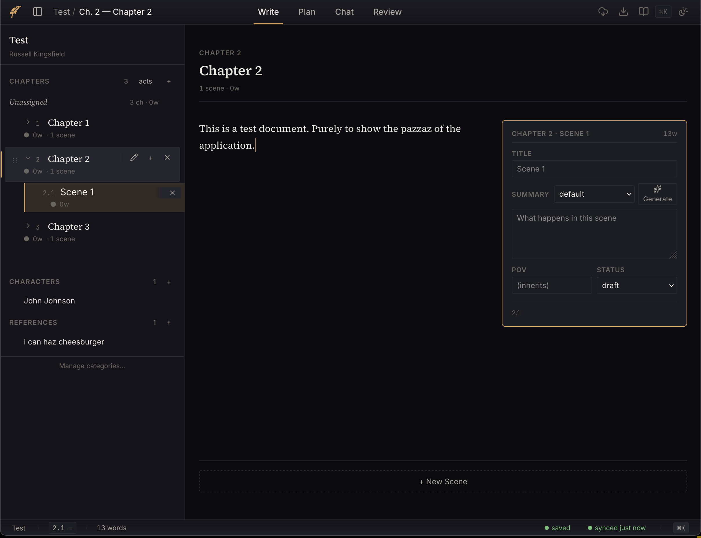
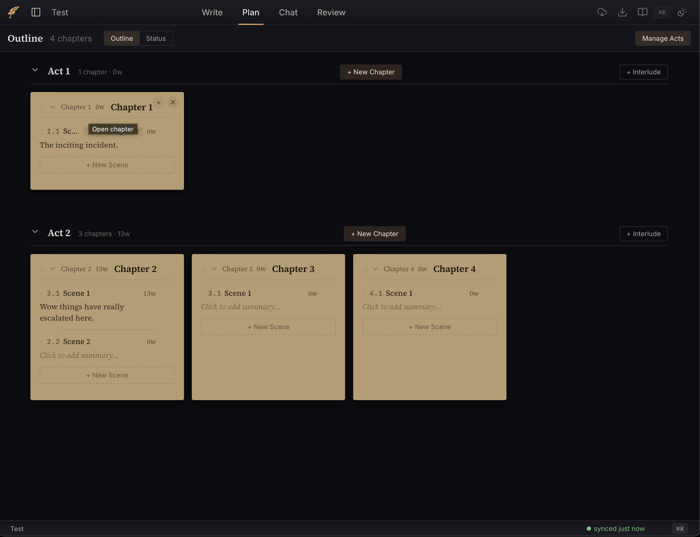
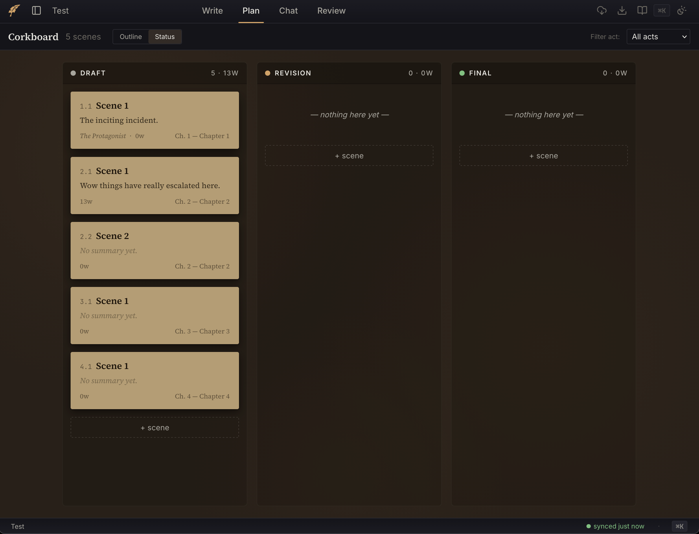
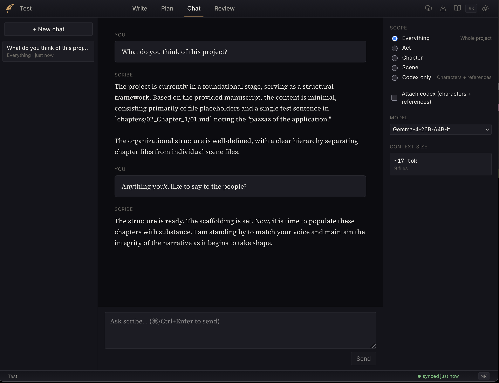

# scribe

A self-hosted writing app for novelists who want to own their files.

Most novel-writing software stores your work in proprietary formats or cloud databases. If the service shuts down or you want to switch tools, you're stuck exporting and hoping nothing breaks. Scribe takes a different approach: your chapters and scenes are plain markdown files in directories on your filesystem. You can `grep` them, `git diff` them, edit them in vim if you want to. The app is a layer on top of your files, not a container around them.

It runs as a single Docker container with a FastAPI backend and React PWA frontend. Point it at a directory of markdown files and go.









It's also a PWA you can pin to your phone or tablet. Edit on the plane, sync when you land -- writes go to IndexedDB immediately and flush to the server whenever you're back online. Conflicts are saved as plaintext files you can merge by hand, so nothing gets lost.

For AI-assisted writing, scribe can generate a RAG recipe from your novel's data -- characters, references, world-building notes -- for ingestion into your own LLM pipeline. You can ask questions about your world and characters without sending your manuscript to a third-party service. Everything stays on your infrastructure.

## What you get

Your novel lives as a directory tree of `.md` files with YAML frontmatter. Chapters are directories, scenes are files inside them. The app wraps that structure in a writing-focused UI:

- A distraction-free editor (CodeMirror 6) with live markdown preview, typewriter mode, and codex-aware character name highlighting
- Drag-and-drop scene and chapter reordering, including cross-chapter scene moves
- Outline and status corkboard views for planning at the act/chapter level
- AI chat and rewrite with configurable scope (scene, chapter, act, everything, codex), supporting OpenAI-compatible endpoints and the Anthropic API
- Per-novel RAG recipe generation for external ingest pipelines, with an in-app query interface
- Export to markdown, docx, epub, or html via pandoc, with `[[scene beats]]` stripped by default
- Token-gated beta reader view with highlight-anchored comments that survive edits to the underlying text
- Per-novel git with automatic commits and push to a configured remote

## Getting started

### Docker (recommended)

```bash
docker build -t scribe .
docker run -d \
  -p 3030:3030 \
  -v /path/to/writing:/data/writing \
  -v /path/to/appdata:/data/appdata \
  scribe
```

Open `http://localhost:3030` and create a project, or set `WRITING_ROOT` to an existing directory of markdown files.

### Development

Backend:
```bash
cd backend
python3 -m venv .venv
.venv/bin/pip install -e '.[test]'
.venv/bin/pytest -q              # run tests
uvicorn scribe.main:app --reload # dev server on :8000
```

Frontend:
```bash
cd frontend
npm install
npm run dev                      # vite dev server on :5173
npm run build && npm run typecheck  # CI-equivalent build
```

### Configuration

| Variable | Default | What it does |
|----------|---------|-------------|
| `WRITING_ROOT` | `/data/writing` | Where your novel directories live |
| `APPDATA_ROOT` | `/data/appdata` | App data (git config, RAG recipes) |
| `ORCHESTRATOR_URL` | `http://localhost:11435` | OpenAI-compatible LLM endpoint for chat and rewrite |
| `ANTHROPIC_API_KEY` | unset | Enables Claude models in the model picker |
| `QDRANT_URL` | unset | Qdrant endpoint for RAG queries |
| `EMBED_URL` | unset | Embedding server for RAG queries |
| `AUTOCOMMIT_INTERVAL_MIN` | `10` | Minutes between automatic git commits |

## How it's built

- [ARCHITECTURE.md](docs/ARCHITECTURE.md) -- data model, backend layers, API, frontend modules, sync engine
- [DESIGN.md](docs/DESIGN.md) -- architecture decisions and the reasoning behind them

## License

This project is licensed under the MIT License. See [LICENSE](LICENSE) for details.
